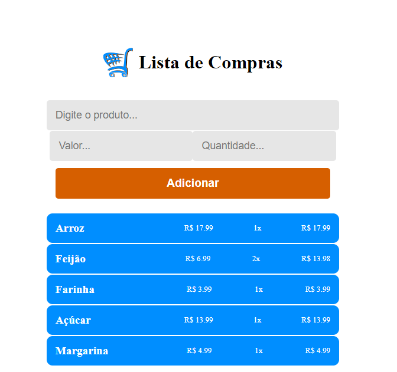

git<h1 align="center"> Lista de Compras </h1>

Aplicação desenvolvida para estudo de ReactJS

  <a href="#-tecnologias">Tecnologias</a>&nbsp;&nbsp;&nbsp;|&nbsp;&nbsp;&nbsp;
  <a href="#-projeto">Projeto</a>&nbsp;&nbsp;&nbsp;|&nbsp;&nbsp;&nbsp;
  <a href="#-layout">Layout</a>&nbsp;&nbsp;&nbsp;|&nbsp;&nbsp;&nbsp;
  <a href="#memo-licença">Licença</a>

  

 

  

## 🚀 Tecnologias

Esse projeto foi desenvolvido com as seguintes tecnologias:

- HTML e CSS
- JavaScript
- [Node e NPM](https://nodejs.org/)
- [Vite](https://vitejs.dev/)

## 💻 Projeto

Uma página onde pode acrescentar uma lista, incluindo o nome, valor e quantidade. 

## 🔖 Layout

Você pode visualizar o layout do projeto através [DESSE LINK]( ). 

## :memo: Licença

Esse projeto está sob a licença MIT.